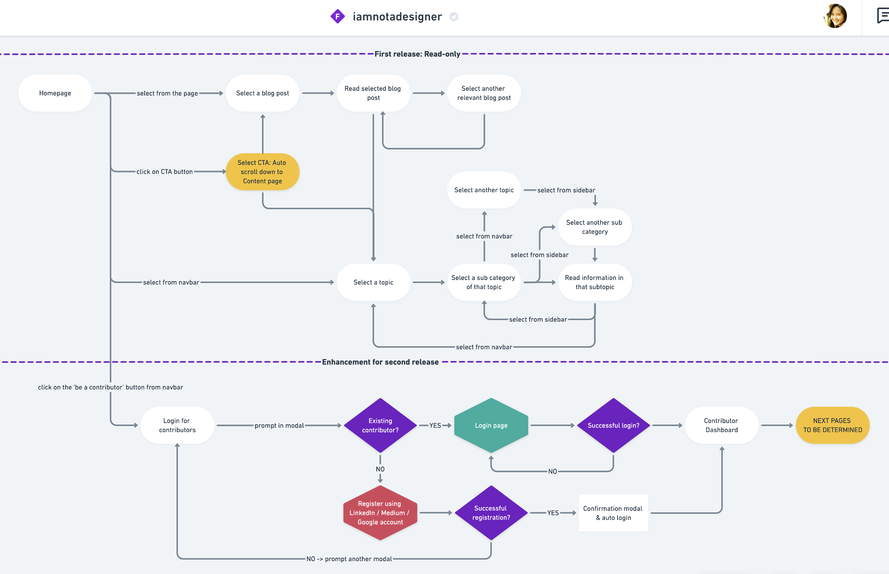
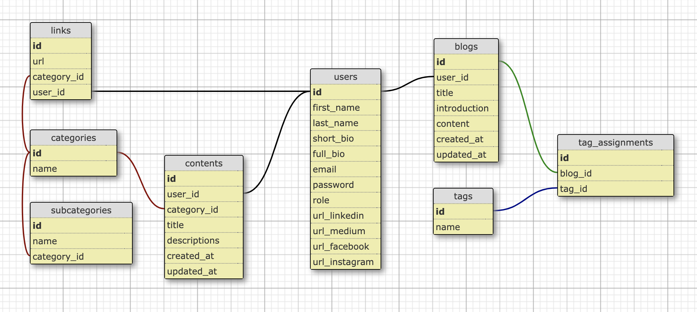

# [I'M NOT A DESIGNER](https://sisiflorensia.github.io/iamnotadesigner/)

This is a non-profit interactive page containing simple guides for developers to a create tasteful web design by themselves.
Contact me if you want to contribute to this page or simply to give me a constructive feedback!

## Target Audience
- Full-stack & back-end developers
- Newbies to web design
- Curious minds

## [User Flow](https://whimsical.com/9gsxwdi5jTNZg8fGdKiBTY#LUSUr8hW5mhmxzDD7F)

## [DB Schema](https://kitt.lewagon.com/db/3180)

## Tools & Programming Languages
- HTML/CSS with vanilla Bootstrap <- temporary layout [here](https://sisiflorensia.github.io/iamnotadesigner/)
- JQuery <- might be replaced with vanilla JS soon
- Incoming: Ruby on Rails <- will be migrated soon
- Heroku as a host <- will need to be migrated once it moves to RoR

## Content Planning (What else to add?)
### Typography
- Trending typefaces
- Fonts pairings
- Icons
- Where to find them?
- How to use them?
### Colors & Themes
- Colors and their meanings
- Color pallete trends
- Color mixing, layers and gradients
- How to use them in CSS?
- References
### UI Components
- What are they?
- Buttons
- Cards
- Navbar
- How to use them?
- How to build customized components yourself?
### UX Best Practice
- Product lifecyle
- User building persona
- Prototyping
- References
### Resources
- Web pages
- Instagram
- References
### In-house Blogs

